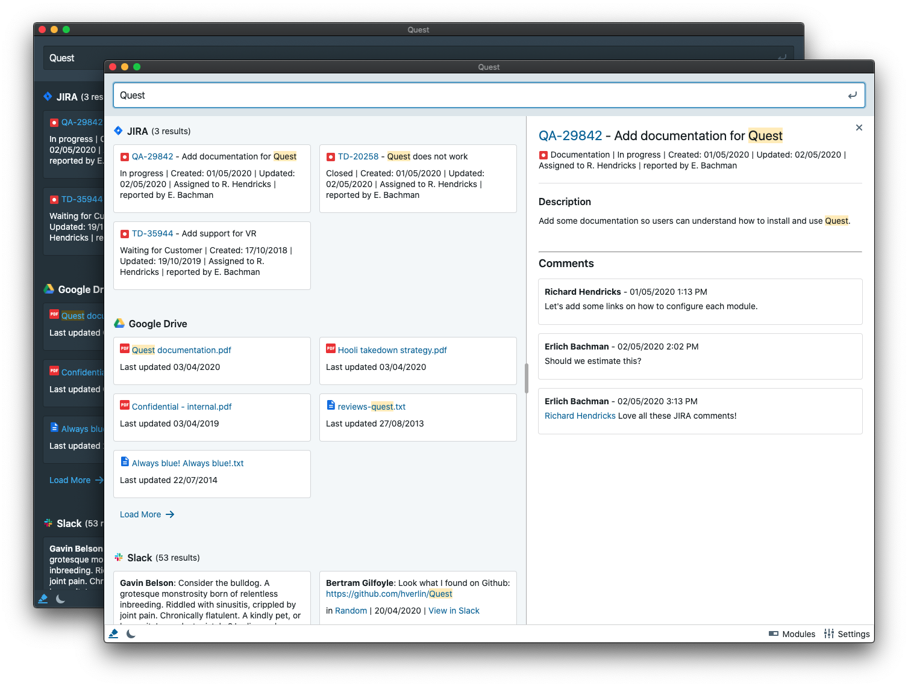

<h1 align="center">
QUEST
</h1>

<p align="center">
  ⚔️ Quest is a Unified Engine for Searching Things  ⚔️
</p>

---

## Introduction
*Quest* is a meta-search client that can connect to various applications and sources. It will submit a search query to all the configured services and aggregate the results.

You can connect it to various services like JIRA, Confluence, Google Drive, Dropbox paper, Slack, etc.



## Features 🚀

- 🔎 Search across many services (see list below). Quickly preview the results.
- 🔓 **Secure and private**: Settings and credentials are encrypted and stored locally. The encryption key is stored in your system's keychain. There are no servers between Quest and the services.
- ⌨️ Usable entirely with the keyboard. You can use the arrow keys to navigate between the results. Use Cmd+Shift+Space (Ctrl+Shift+Space) to focus the application and start searching!
- 🔧 Customizable: Light and dark modes, column or row layout, custom filters...

## Supported modules
See the following links for more information on how to configure them.
- [Confluence Server](src/modules/confluence/readme.md)
- [Google Drive](src/modules/drive/readme.md)
- [Gmail](src/modules/gmail/readme.md)
- [JIRA Server](src/modules/jira/readme.md)
- [Dropbox Paper](src/modules/paper/readme.md)
- [Phabricator (revision)](src/modules/phab-revision/readme.md)
- [Slack](src/modules/slack/readme.md)
- [Redmine](src/modules/redmine/readme.md)
- [Nextcloud](src/modules/nextcloud/readme.md)

More to come...

## How do I install it?
You can install *Quest* by going to the [releases page](https://github.com/hverlin/Quest/releases).

You will need to configure all the modules you want to connect to. This often means generating an API key in the developer section of each service. Note that for services that support Oauth (e.g. Gmail, Slack, Google Drive) you can generate one app for your team/organization and share that internally.

Click on the application name in the list above to see how to get instructions on how to configure them.

- Note that the application is not signed yet, so you might need to [allow it to run](https://www.wikihow.com/Install-Software-from-Unsigned-Developers-on-a-Mac).
- Auto-update is not yet available as well for that reason. You will need to check the releases page again to download an updated version of the application.

## Q&A

> Why not used an indexing service such as [Kendra](https://aws.amazon.com/kendra/), [Elastic search](https://www.elastic.co/) or [Algolia](https://www.algolia.com/)?

Quest is very lightweight and easy to install. While it does not provide the same unified experience, it is good enough to search across many services without relying on an expensive setup.

> Which search features are available?

Quest is directly using the search APIs provided by the applications you are connecting to. It means it cannot support more advanced queries than these services can support.

Right now, it is only capable of doing a full-text search as well as excluding terms using the minus sign: `-`.

Some date filters are also available when the services support it.

> Can I add the same service multiple times?

Yes, you can e.g. add several Gmail accounts or add several times a Confluence/JIRA module, but with a different base filter (e.g., one per space)

> Can I override the keyboard shortcuts

Yes, but this a bit advanced. At the bottom of the settings, there is a button called `Edit configuraton`. From there, you can edit the shortcuts and replace the default ones. Don't forget to save and restart the application.

> Do you support `$SERVICE_NAME`?

Probably not yet, the full list is on that page. (See supported modules). You can file an issue if you would like a particular app to be supported.

Feel free to contribute to Quest if you would like a particular service to be supported. There is no guide on how to add a new service yet but you simply copy-paste an existing module and start from there.

> Why is this an Electron app? Electron app are big and often slow.

Without Electron, this application would probably not exist. 
I wish there would be another way to build a cross-platform app in such an easy way.
(but obviously, downloading a 70Mb application that renders a simple search UI is far from optimal)

## Development

Quest is built with React, Electron and [Blueprint](https://blueprintjs.com).

Make sure to read about [React-query](https://github.com/tannerlinsley/react-query) and [hookstate](https://github.com/avkonst/hookstate) before contributing.

### Requirement for Linux only

We use the package [keytar](http://atom.github.io/node-keytar/) to handle storage of encrypted settings and credentials in your system's keychain.
Currently, this library uses `libsecret` on Linux platform, so you may need to install it before running `npm ci`:
* Debian/Ubuntu: `sudo apt-get install libsecret-1-dev`
* Red Hat-based: `sudo yum install libsecret-devel`
* Arch Linux: `sudo pacman -S libsecret`

### Running
Make sure you have a recent version of NodeJS installed (10+).
```
npm ci
npm start
```

Note that a different configuration file is used in development mode.

### Creating an executable
```
npm run make
```
The app will be located in the `/out` directory.

### License 
Licensed under the MIT license.

Icon made by [Pixel perfect](https://www.flaticon.com/authors/pixel-perfect) from www.flaticon.com
